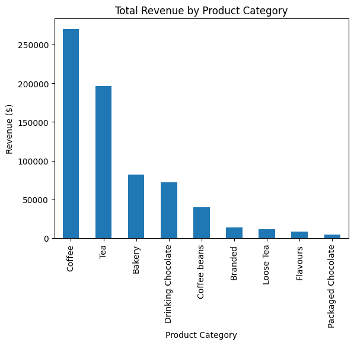
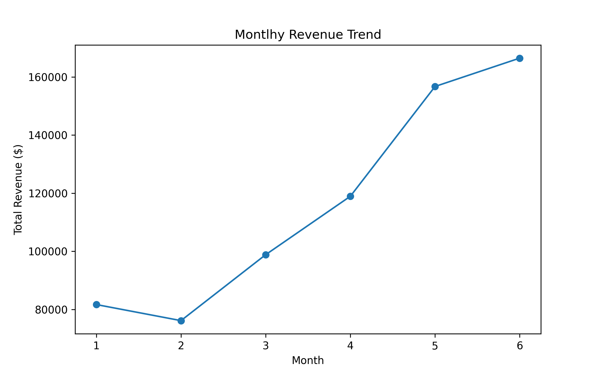
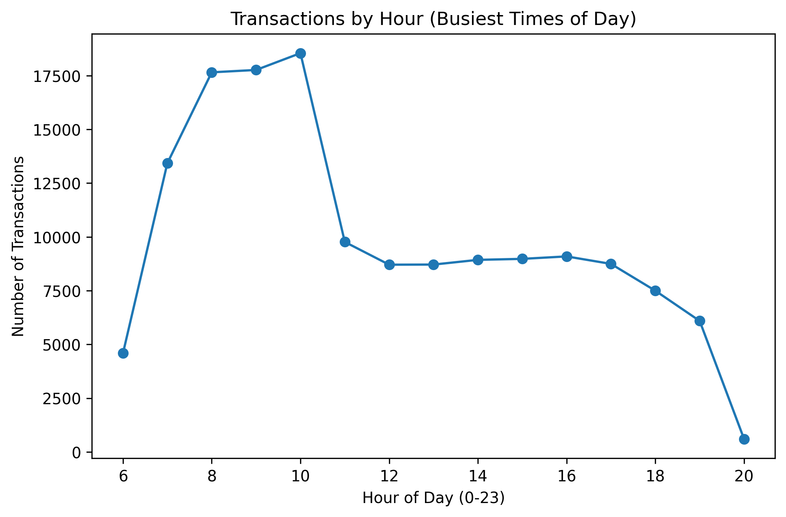

# Coffee Shop Sales Analytics & Customer Insights

##  Business Problem
A coffee shop wants to better understand customer purchasing behavior and sales trends to improve revenue.

##  Project Goal
This project answers:

- What products generate the most revenue?
- What times of day are busiest?
- What does a typical transaction look like?
- Can we identify high-value purchases?

##  Key Steps
1. Data cleaning  
2. Exploratory Data Analysis (EDA)  
3. Sales and revenue visualizations  
4. High-value transaction detection  
5. Simple predictive modeling (optional)

##  Key Findings (Current Data)

Using the available monthly revenue totals (Jan–Jun), we observed:

- Revenue shows an overall upward trend from January to June.
- February had a small decline compared to January (–$5.5K).
- The largest increase occurred between April and May (+$37.8K).
- May and June represent the strongest sales months in the dataset.
These trends suggest increased customer demand starting in spring.

## (Transaction Revenue)

- Most transactions are small, with a median revenue of **$3.75**, meaning a typical customer spends around $3–$4 per purchase.
- The dataset contains rare high-value transactions up to **$360**, which may represent bulk orders or potential outliers worth investigating.
- The highest revenue transactions come from bulk purchases of Premium Coffee Beans (8 units at $45 each), suggesting that bean sales contribute disproportionately to revenue despite being rare.
- The highest-value transactions ($360 Premium Beans bulk orders) occur extremely rarely (only 10 purchases, 0.007% of transactions) and contribute just 0.5% of total revenue. This suggests that overall revenue is driven primarily by high-frequency, low-value daily purchases rather than occasional bulk orders.
- Coffee is the primary revenue driver ($270K), followed by Tea ($196K). Together, beverages account for the majority of total sales, while categories like Bakery and Coffee Beans contribute smaller shares.

## Revenue by Product Category

## Monthly Revenue Trend

This chart shows how total revenue changes month to month across the dataset.

- Revenue increases steadily from January through June.
- The strongest months occur in late spring and early summer, suggesting seasonal growth or increased customer demand.
- This trend indicates that overall business performance is driven by consistent daily purchases rather than rare bulk transactions.

## Busiest Hours of the Day

This chart shows the number of transactions by hour.

- The peak hours represent the busiest times for the coffee shop.
- This insight can guide staffing decisions, inventory prep, and promotion timing.
- In future analysis, we can compare peak hours by store location.

##  Tools Used
- Python  
- pandas  
- matplotlib  
- NumPy  

##  Next Steps
- Predict high-value transactions  
- Build a dashboard-style summary  
