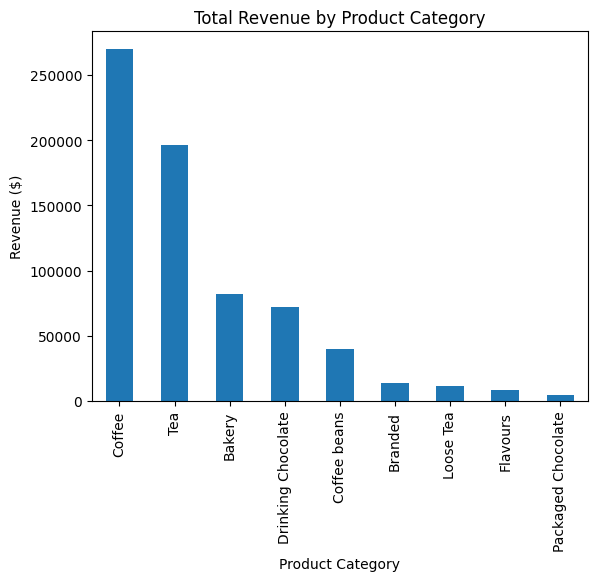
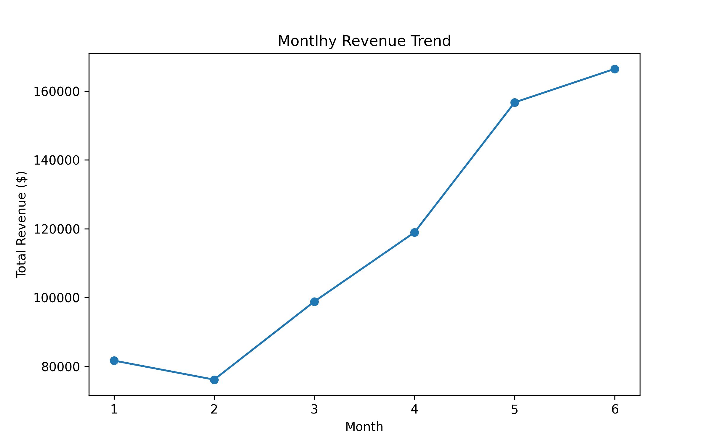
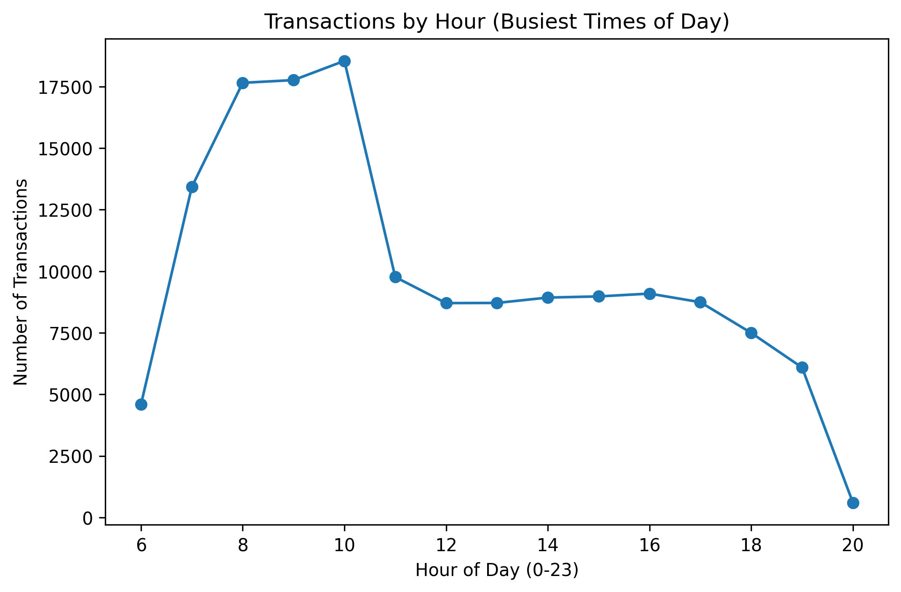
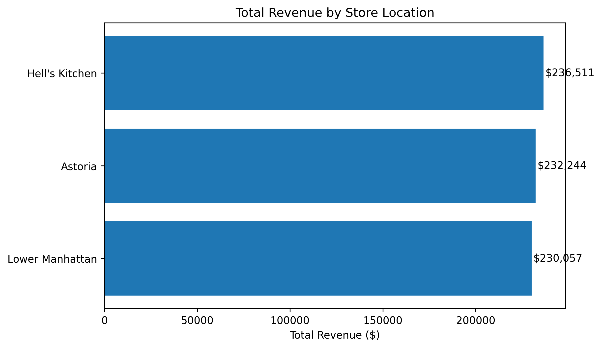
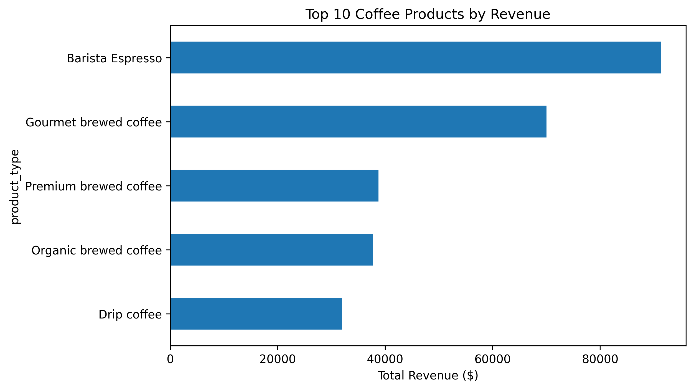
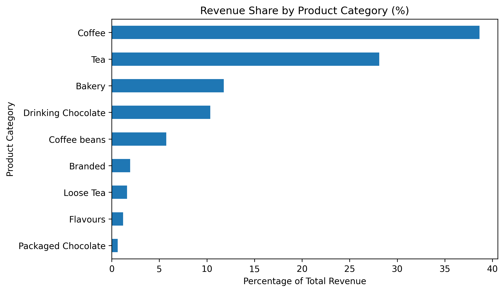
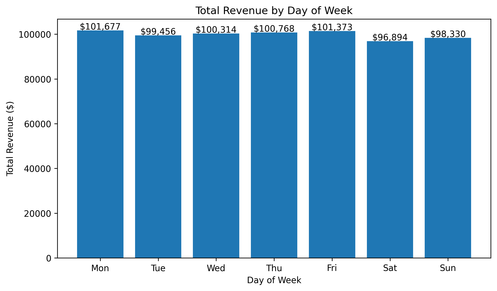

# Coffee Shop Sales Analytics & Customer Insights

## Business Problem

A coffee shop chain wants to better understand its **sales performance and customer purchasing behavior** in order to optimize revenue, inventory management, and staffing decisions.

Despite having large volumes of transaction data, the business lacks clear insights into:

- Which products drive the majority of revenue
- When customers are most active throughout the day
- How revenue changes over time
- Whether certain store locations perform better than others
- What a typical customer purchase looks like

Using transaction-level sales data, this project analyzes purchasing patterns to uncover actionable insights that can help improve operational efficiency and business strategy.

## Project Goal

The goal of this project is to perform **exploratory data analysis (EDA)** on coffee shop sales data to uncover patterns in revenue generation and customer purchasing behavior.

The analysis focuses on answering the following key questions:

- Which **product categories** generate the most revenue?
- Which **specific coffee products** are the top performers?
- How does **revenue change over time**?
- What are the **busiest hours of the day**?
- Do **store locations perform differently**?
- What does a **typical transaction value** look like?

By answering these questions, the analysis provides insights that could support **pricing strategy, staffing decisions, marketing promotions, and inventory planning**.

## Methodology

The analysis followed these main steps:

1. **Data Cleaning**
   - Verified column types
   - Created revenue variables
   - Checked for missing or inconsistent values

2. **Exploratory Data Analysis (EDA)**
   - Investigated transaction values
   - Examined purchasing distributions

3. **Revenue Analysis**
   - Revenue by product category
   - Revenue by store location
   - Revenue trends over time

4. **Customer Behavior Analysis**
   - Transactions by hour of day
   - Average order value (AOV)

5. **Product Performance Analysis**
   - Identification of top-performing coffee products

## Key Findings

### Revenue Trends

- Revenue shows a clear **upward trend from January through June**.
- The largest increase occurs between **April and May**, suggesting increased customer demand during late spring.
- May and June represent the **strongest revenue months** in the dataset.

### Transaction Behavior

- The **median transaction value is $3.75**, indicating that most purchases are small individual items such as drinks.
- Rare bulk purchases exist (up to **$360**), but they represent a very small percentage of transactions.
- Overall revenue is primarily driven by **high-frequency, low-value purchases**, typical of coffee shop businesses.

### Product Performance

- **Coffee is the primary revenue driver**, accounting for roughly **38% of total revenue**.
- **Tea is the second-largest category**, contributing approximately **28%**.
- Together, beverage products generate **the majority of the store's revenue**.

### Store Performance

- Revenue across the three store locations is **very similar**, suggesting consistent performance across locations.
- Hell's Kitchen generates slightly higher revenue, but the difference is small.

### Customer Activity Patterns

- Customer traffic peaks during the **morning hours**, particularly between **8 AM and 10 AM**.
- This confirms the typical **morning coffee demand pattern** seen in coffee shops.

## Revenue by Product Category

To understand which types of products drive the business, total revenue was aggregated by **product category**.

This analysis helps identify the **primary revenue sources** for the coffee shop and highlights which product groups have the greatest impact on overall sales.

Understanding category-level performance can support decisions related to:

- menu design
- promotional campaigns
- inventory prioritization

## Monthly Revenue Trend

To analyze how business performance changes over time, total revenue was aggregated **by month**.

This visualization highlights overall **sales growth patterns and potential seasonal effects** within the dataset.

Identifying revenue trends helps businesses anticipate demand changes and plan inventory, staffing, and promotions accordingly.

## Transactions by Hour (Busiest Times of Day)

Customer activity was analyzed by counting the **number of transactions per hour** throughout the day.

This analysis helps identify peak demand periods and provides insights that can support:

- staffing optimization
- preparation of inventory
- targeted promotional timing

## Revenue by Store Location

To compare store performance, total revenue was calculated for each store location.

This analysis helps determine whether revenue growth is driven by **location performance** or **product demand**.

Understanding location differences can help inform expansion strategy, staffing allocation, and operational improvements.

## Top Coffee Products by Revenue

After identifying coffee as the largest revenue category, the analysis drills down into **individual coffee products**.

This helps determine which specific drinks contribute most to revenue and can guide:

- menu optimization
- targeted marketing promotions
- inventory planning

## Average Order Value (AOV)

Average Order Value (AOV) measures the **average revenue generated per transaction**.

This metric helps businesses understand **typical customer spending behavior** and evaluate pricing strategies.

AOV was calculated both **across all transactions** and **by store location** to determine whether customer spending patterns differ between locations.

When comparing store locations:

- **Lower Manhattan** shows the highest average order value ($4.81)
- **Hell's Kitchen** averages $4.66
- **Astoria** averages $4.59

The small differences suggest customer spending behavior is relatively consistent across locations, with Lower Manhattan customers spending slightly more per visit.

## Revenue Share by Product Category

To better understand the business structure, revenue was analyzed as a **percentage contribution by product category**.

This reveals the relative importance of each product category within the overall revenue mix.

The analysis shows that **Coffee accounts for approximately 38% of total revenue**, while **Tea contributes about 28%**.

Together, beverage products generate roughly **two-thirds of the coffee shop’s total revenue**, confirming that drinks are the primary driver of the business.

This insight suggests that strategies focused on beverage promotions, menu innovation, and upselling drinks are likely to have the greatest impact on overall revenue growth.

## Revenue by Day of Week

Revenue was analyzed across the days of the week to identify demand patterns and potential operational insights.

Understanding which days generate the most revenue helps businesses plan staffing levels, inventory preparation, and promotional campaigns.

The results show that revenue is **remarkably consistent across the entire week**, indicating stable customer demand rather than reliance on specific high-traffic days.

##  Tools Used
- Python  
- pandas  
- matplotlib  
- NumPy  

##  Next Steps
- Predict high-value transactions  
- Build a dashboard-style summary  
